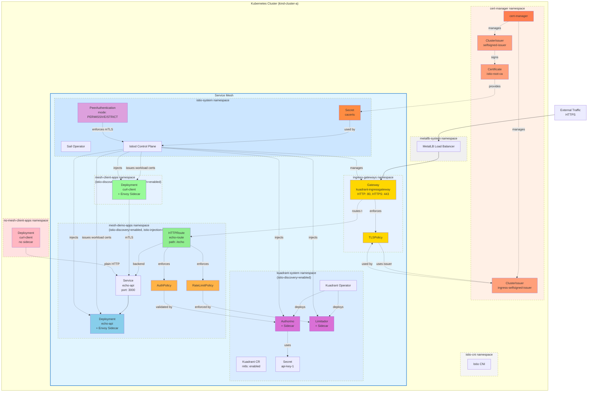

# Multi-Mesh App Security with Kuadrant

This repository demonstrates Istio service mesh configurations with Kuadrant and custom CA certificates managed by cert-manager.

## Examples

### 1. [Single Cluster, Single Mesh](examples/single-cluster-single-mesh/)
Demonstrates a complete Istio service mesh with custom CA certificates.

**Features:**
- One Kubernetes cluster (kind)
- One Istio mesh
- Custom CA certificates via cert-manager
- mTLS communication between workloads
- Kuadrant integration

**Run:**
```bash
make setup-example-1
```

**Docs:** [examples/single-cluster-single-mesh/README.md](examples/single-cluster-single-mesh/README.md)


#### Architecture Overview

##### Example 1: Single Mesh



---

### 2. [Single Cluster, Dual Mesh](examples/single-cluster-dual-mesh/)
Demonstrates two independent Istio meshes in the same cluster with shared root CA.

**Features:**
- One Kubernetes cluster (kind)
- Two independent Istio meshes
- Shared root CA for cross-mesh mTLS
- Separate control planes and trust domains
- Cross-mesh secure communication

**Run:**
```bash
make setup-example-2
```

**Docs:** [examples/single-cluster-dual-mesh/README.md](examples/single-cluster-dual-mesh/README.md)

##### Example 2: Dual Mesh

```mermaid
graph TB
    subgraph Cluster["Kubernetes Cluster (kind-cluster-a)"]
        subgraph NS_CertManager["cert-manager namespace"]
            CertManager[cert-manager]
            RootCA[Shared Root CA<br/>for mesh mTLS]
            IngressIssuer[ClusterIssuer<br/>ingress-selfsigned-issuer]
        end

        subgraph NS_CNI["istio-cni namespace"]
            IstioCNI[Istio CNI<br/>shared by both meshes]
        end

        subgraph Mesh1["Mesh-1"]
            subgraph NS_Istio1["istio-system namespace"]
                Istiod1[Istiod Control Plane]
                PeerAuth1[PeerAuthentication<br/>mode: STRICT]
                CacertsSecret1[Secret<br/>cacerts]
            end

            subgraph NS_Kuadrant["kuadrant-system namespace<br/>(mesh=mesh-1, istio.io/rev=default)"]
                KuadrantOp[Kuadrant Operator]
                Authorino[Authorino<br/>+ Sidecar]
                Limitador[Limitador<br/>+ Sidecar]
                APIKey[Secret: api-key-1]
            end

            subgraph NS_GW["ingress-gateways namespace<br/>(mesh=mesh-1)"]
                GW[Gateway<br/>kuadrant-ingressgateway<br/>HTTPS:443<br/>demo.10.89.0.0.nip.io]
                TLSPolicy[TLSPolicy]
                SE_Mesh2[ServiceEntry<br/>echo-api-2]
            end

            subgraph NS_Apps1["mesh-demo-apps namespace<br/>(mesh=mesh-1, istio.io/rev=default)"]
                Route1[HTTPRoute<br/>echo-route<br/>path: /echo]
                AuthPolicy[AuthPolicy]
                RLPolicy[RateLimitPolicy]
                Echo1[echo-api<br/>Service + Deployment<br/>+ Sidecar]
            end

            subgraph NS_Client1["mesh-client-apps namespace<br/>(mesh=mesh-1, istio.io/rev=default)"]
                Curl1[curl-client<br/>Deployment<br/>+ Sidecar]
                SE1[ServiceEntry<br/>echo-api-2.mesh-demo-apps-2]
            end
        end

        subgraph Mesh2["Mesh-2"]
            subgraph NS_Istio2["istio-system-2 namespace"]
                Istiod2[Istiod Control Plane]
                PeerAuth2[PeerAuthentication<br/>mode: STRICT]
                CacertsSecret2[Secret<br/>cacerts]
            end

            subgraph NS_Apps2["mesh-demo-apps-2 namespace<br/>(mesh=mesh-2, istio.io/rev=default-2)<br/>(discovered by mesh-1)"]
                Route2[HTTPRoute<br/>echo-route-2<br/>path: /echo2]
                Echo2[echo-api-2<br/>Service + Deployment<br/>+ Sidecar]
            end

            subgraph NS_Client2["mesh-client-apps-2 namespace<br/>(mesh=mesh-2, istio.io/rev=default-2)"]
                Curl2[curl-client<br/>Deployment<br/>+ Sidecar]
                SE2[ServiceEntry<br/>echo-api.mesh-demo-apps]
            end
        end
    end

%% External traffic flow
    External[External Traffic<br/>demo.*.nip.io] --> GW

%% Gateway policy enforcement
    GW -.enforces.-> TLSPolicy
    TLSPolicy -.uses.-> IngressIssuer

%% Routing
    GW -.routes to.-> Route1
    GW -.routes to.-> Route2

%% Mesh-1 route policies
    Route1 -.enforces.-> AuthPolicy
    Route1 -.enforces.-> RLPolicy
    Route1 -.backend.-> Echo1

%% Cross-mesh discovery and routing
    SE_Mesh2 -.discovers.-> Echo2
    Route2 -.backend.-> Echo2

%% Kuadrant policy enforcement
    AuthPolicy -.validated by.-> Authorino
    Authorino -.uses.-> APIKey
    RLPolicy -.enforced by.-> Limitador

%% Certificate management
    CertManager -.manages.-> IngressIssuer
    CertManager -.manages.-> RootCA
    RootCA -.shared by.-> CacertsSecret1
    RootCA -.shared by.-> CacertsSecret2
    CacertsSecret1 -.used by.-> Istiod1
    CacertsSecret2 -.used by.-> Istiod2

%% Istio control plane management
    Istiod1 -.manages.-> GW
    Istiod1 -.injects sidecars.-> Authorino
    Istiod1 -.injects sidecars.-> Limitador
    Istiod1 -.injects sidecars.-> Echo1
    Istiod1 -.injects sidecars.-> Curl1
    Istiod2 -.injects sidecars.-> Echo2
    Istiod2 -.injects sidecars.-> Curl2

%% mTLS enforcement
    PeerAuth1 -.enforces mTLS.-> Istiod1
    PeerAuth2 -.enforces mTLS.-> Istiod2

%% Intra-mesh communication
    Curl1 -.intra-mesh mTLS.-> Echo1
    Curl2 -.intra-mesh mTLS.-> Echo2

%% Cross-mesh communication
    SE1 -.declares.-> Echo2
    SE2 -.declares.-> Echo1
    Curl1 -.cross-mesh mTLS.-> Echo2
    Curl2 -.cross-mesh mTLS.-> Echo1

%% Styling - Mesh boundaries (solid)
    style Mesh1 fill:#e1f5ff,stroke:#0066cc,stroke-width:2px
    style Mesh2 fill:#ffe1f5,stroke:#cc0066,stroke-width:2px

%% Styling - Infrastructure namespaces (dashed)
    style NS_CertManager fill:#fff0e6,stroke-dasharray: 5 5
    style NS_CNI fill:#f5f5f5,stroke-dasharray: 5 5

%% Styling - Mesh-1 namespaces (dashed, blue tint)
    style NS_Istio1 fill:#cce6ff,stroke-dasharray: 5 5
    style NS_Kuadrant fill:#d9ecff,stroke-dasharray: 5 5
    style NS_GW fill:#e6f2ff,stroke-dasharray: 5 5
    style NS_Apps1 fill:#d9ecff,stroke-dasharray: 5 5
    style NS_Client1 fill:#e6f2ff,stroke-dasharray: 5 5

%% Styling - Mesh-2 namespaces (dashed, pink tint)
    style NS_Istio2 fill:#ffcce6,stroke-dasharray: 5 5
    style NS_Apps2 fill:#ffd9ec,stroke-dasharray: 5 5
    style NS_Client2 fill:#ffe6f2,stroke-dasharray: 5 5

%% Styling - Components
    style GW fill:#ffd700
    style TLSPolicy fill:#ff6b6b
    style AuthPolicy fill:#ff8c42
    style RLPolicy fill:#ff8c42
    style Route1 fill:#ffb347
    style Route2 fill:#90ee90
    style Echo1 fill:#87ceeb
    style Echo2 fill:#dda0dd
    style Curl1 fill:#98fb98
    style Curl2 fill:#ffb6c1
    style Istiod1 fill:#87ceeb
    style Istiod2 fill:#dda0dd
    style PeerAuth1 fill:#87ceeb
    style PeerAuth2 fill:#dda0dd
    style CacertsSecret1 fill:#ff8c42
    style CacertsSecret2 fill:#ff8c42
    style KuadrantOp fill:#da70d6
    style Authorino fill:#da70d6
    style Limitador fill:#da70d6
    style CertManager fill:#ff7f50
    style RootCA fill:#ffa07a
    style IngressIssuer fill:#ffa07a
    style SE1 fill:#ffd700
    style SE2 fill:#ffd700
    style SE_Mesh2 fill:#ffd700
```



---

## Quick Start

Choose an example and run:

```bash
# Example 1 - Single mesh with custom certificates
make setup-example-1

# Example 2 - Dual mesh with shared CA
make setup-example-2
```

## Prerequisites

- [kind](https://kind.sigs.k8s.io/) - Kubernetes in Docker
- kubectl
- helm
- jq
- yq

## Cluster Management

```bash
# Create cluster
make create-cluster-a

# Delete cluster
make delete-cluster-a

# Delete all clusters
make clean
```

## Repository Structure

```
euro-info/
├── Makefile                                    # Top-level orchestrator
├── README.md                                   # This file
├── kind/                                       # Shared cluster configs
│   ├── kind-cluster-a.yaml                     # Kind cluster configuration
│   └── kind-cluster-b.yaml                     # (Reserved for multi-cluster)
│
├── examples/
│   ├── single-cluster-single-mesh/            # Example 1: Single mesh with Kuadrant
│   │   ├── README.md                          # Complete setup guide
│   │   ├── Makefile                           # Example-specific targets
│   │   ├── config/
│   │   │   ├── cert-manager/                  # CA certificates (mesh mTLS)
│   │   │   │   ├── root-ca.yaml               # Root CA certificate
│   │   │   │   └── ingress-issuer.yaml        # Gateway HTTPS issuer
│   │   │   ├── istio/                         # Istio configuration
│   │   │   │   ├── istio.yaml                 # Istio CR (control plane)
│   │   │   │   ├── cni.yaml                   # Istio CNI
│   │   │   │   ├── gateway/                   # Gateway configs
│   │   │   │   └── mtls/                      # PeerAuthentication
│   │   │   ├── apps/                          # Application manifests
│   │   │   │   ├── echo.yaml                  # echo-api deployment
│   │   │   │   ├── echo-route.yaml            # HTTPRoute
│   │   │   │   ├── curl-mesh.yaml             # curl client (in mesh)
│   │   │   │   └── curl-no-mesh.yaml          # curl client (outside mesh)
│   │   │   ├── kuadrant/                      # Kuadrant policies
│   │   │   │   ├── kuadrant.yaml              # Kuadrant CR
│   │   │   │   ├── tlspolicy.yaml             # Gateway TLS
│   │   │   │   ├── authpolicy.yaml            # API key auth
│   │   │   │   └── ratelimitpolicy.yaml       # Rate limiting
│   │   │   └── metallb/                       # Load balancer
│   │   │       └── metallb.yaml               # IP address pool
│   │   └── scripts/
│   │       └── create-istio-cacerts.sh        # CA secret creation script
│   │
│   └── single-cluster-dual-mesh/             # Example 2: Dual mesh with Kuadrant
│       ├── README.md                          # Complete setup guide
│       ├── Makefile                           # Example-specific targets
│       ├── config/
│       │   ├── cert-manager/                  # Shared CA for both meshes
│       │   │   ├── root-ca.yaml               # Shared root CA
│       │   │   └── ingress-issuer.yaml        # Gateway HTTPS issuer
│       │   ├── istio/                         # Istio configurations
│       │   │   ├── istio-mesh-1.yaml          # Mesh-1 control plane
│       │   │   ├── istio-mesh-2.yaml          # Mesh-2 control plane
│       │   │   ├── cni.yaml                   # Shared Istio CNI
│       │   │   └── mtls/                      # PeerAuthentication per mesh
│       │   │       ├── peerauthentication-mesh-1.yaml
│       │   │       └── peerauthentication-mesh-2.yaml
│       │   ├── apps/                          # Application manifests
│       │   │   ├── echo-mesh-1.yaml           # echo-api in mesh-1
│       │   │   ├── echo-mesh-2.yaml           # echo-api-2 in mesh-2
│       │   │   ├── echo-route.yaml            # HTTPRoute for mesh-1
│       │   │   ├── echo-route-2.yaml          # HTTPRoute for mesh-2
│       │   │   ├── curl-client-mesh-1.yaml    # curl client in mesh-1
│       │   │   ├── curl-client-mesh-2.yaml    # curl client in mesh-2
│       │   │   ├── serviceentry-mesh-1-to-mesh-2.yaml    # Cross-mesh discovery
│       │   │   ├── serviceentry-mesh-2-to-mesh-1.yaml    # Cross-mesh discovery
│       │   │   └── serviceentry-gateway-to-mesh-2.yaml   # Gateway to mesh-2
│       │   ├── kuadrant/                      # Kuadrant policies (mesh-1)
│       │   │   ├── kuadrant.yaml              # Kuadrant CR
│       │   │   ├── gateway.yaml               # Gateway in mesh-1
│       │   │   ├── tlspolicy.yaml             # Gateway TLS
│       │   │   ├── authpolicy.yaml            # Auth (mesh-1 /echo only)
│       │   │   └── ratelimitpolicy.yaml       # Rate limit (mesh-1 /echo only)
│       │   └── metallb/                       # Load balancer
│       │       └── metallb.yaml               # IP address pool
│       └── scripts/
│           └── create-istio-cacerts.sh        # CA secret creation script
```

## TODO

### ✅ 1. Custom Certificates for mTLS with cert-manager
- [x] Create root CA certificate using cert-manager
- [x] Configure Issuer/ClusterIssuer for custom certificates
- [x] Generate CA certificates (using single-level hierarchy)
- [x] Document certificate creation process
- [x] Configure Istio to use custom certificates from cert-manager
- [x] Validate mTLS with custom certificates
- [x] Refactor into example-1

**Status:** Complete. See [Example 1](examples/single-cluster-single-mesh/).

**Certificate Details:**
- Root CA lifetime: 10 years
- Single-level hierarchy (root CA directly signs workload certificates)
- Certificates managed by cert-manager
- Trust domain: `10.89.0.0.nip.io`

---

### ✅ 2. Two Service Meshes in Same Cluster
- [x] Deploy second Istio control plane (mesh-2)
- [x] Configure separate istio-system-2 namespace
- [x] Set up mesh-1 and mesh-2 with separate discovery
- [x] Share same custom certificates across both meshes
- [x] Configure mTLS between services in different meshes
- [x] Deploy demo apps/curl clients in each mesh namespace
- [x] Test cross-mesh communication with shared certificates
- [x] Add architecture diagram with dual mesh setup
- [x] Document mesh isolation and certificate sharing

**Status:** Complete. See [Example 2](examples/single-cluster-dual-mesh/).

---

### ✅ 3. Secure echo-api with Kuadrant

#### Part 1: Single Cluster Single Mesh
- [x] Configure TLSPolicy for echo-api using custom certificates
- [x] Implement AuthPolicy for authentication
- [x] Add RateLimitPolicy for API protection
- [x] Test HTTPS access to echo-api through gateway
- [x] Validate certificate chain and mTLS end-to-end
- [x] Test RateLimit and Auth Policies
- [x] Update Docs with Kuadrant security configuration

#### Part 2: Single Cluster Dual Mesh
Apply the above for `echo-api` in `demo-apps` namespace, `demo-apps-2` won't be protected
- [x] Configure TLSPolicy for echo-api using custom certificates
- [x] Implement AuthPolicy for authentication
- [x] Add RateLimitPolicy for API protection
- [x] Test HTTPS access to echo-api through gateway
- [x] Validate certificate chain and mTLS end-to-end
- [x] Connect with Gateway and HTTPRoute `echo-api-2` but unprotected
- [x] Document Kuadrant security configuration

---

### 4. Multi-Cluster with Same Mesh Configuration
- [ ] Set up cluster-b with same Istio version and configuration
- [ ] Configure shared root CA across both clusters
- [ ] Distribute custom certificates to cluster-a and cluster-b
- [ ] Configure east-west gateway for cross-cluster communication
- [ ] Set up service mesh federation between clusters
- [ ] Configure cross-cluster service discovery
- [ ] Enable mTLS for cross-cluster traffic using shared certificates
- [ ] Deploy echo-api and curl-client across both clusters
- [ ] Test cross-cluster mTLS communication
- [ ] Configure multi-cluster gateway and routing
- [ ] Add multi-cluster architecture diagram
- [ ] Document multi-cluster certificate management

---
