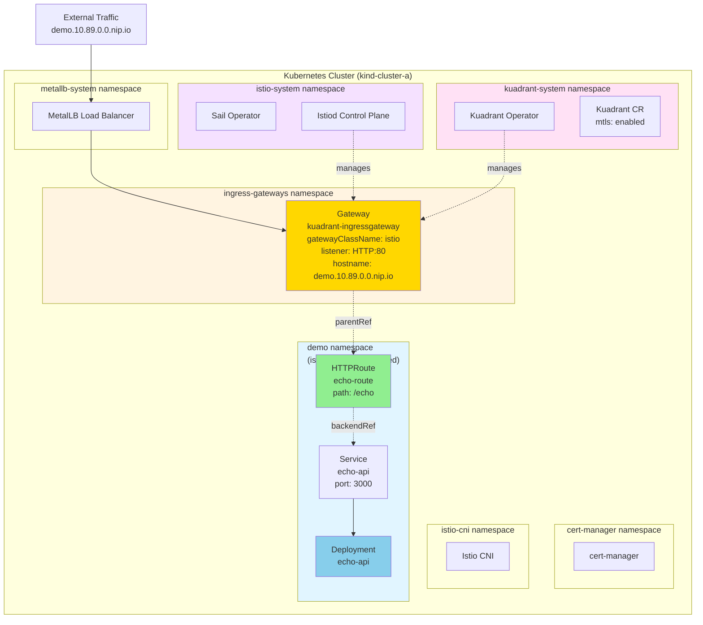

# Multi Cluster App Security with Kuadrant

## Single Cluster Architecture

```mermaid
graph TB
    subgraph Cluster["Kubernetes Cluster (kind-cluster-a)"]
        subgraph NS_MetalLB["metallb-system namespace"]
            MetalLB[MetalLB Load Balancer]
        end

        subgraph NS_CertManager["cert-manager namespace"]
            CertManager[cert-manager]
        end

        subgraph NS_Istio["istio-system namespace"]
            SailOperator[Sail Operator]
            Istiod[Istiod Control Plane]
        end

        subgraph NS_CNI["istio-cni namespace"]
            IstioCNI[Istio CNI]
        end

        subgraph NS_Kuadrant["kuadrant-system namespace"]
            KuadrantOp[Kuadrant Operator]
            KuadrantCR[Kuadrant CR<br/>mtls: enabled]
        end

        subgraph NS_Gateway["ingress-gateways namespace"]
            GW[Gateway<br/>kuadrant-ingressgateway<br/>gatewayClassName: istio<br/>listener: HTTP:80<br/>hostname: demo.10.89.0.0.nip.io]
        end

        subgraph NS_Demo["demo namespace<br/>(istio-discovery=enabled)"]
            HTTPRoute[HTTPRoute<br/>echo-route<br/>path: /echo]
            EchoSvc[Service<br/>echo-api<br/>port: 3000]
            EchoDep[Deployment<br/>echo-api<br/>]
        end
    end

    External[External Traffic<br/>demo.10.89.0.0.nip.io] --> MetalLB
    MetalLB --> GW
    GW -.parentRef.-> HTTPRoute
    HTTPRoute -.backendRef.-> EchoSvc
    EchoSvc --> EchoDep

    Istiod -.manages.-> GW
    KuadrantOp -.manages.-> GW

    style NS_Demo fill:#e1f5ff
    style NS_Gateway fill:#fff4e1
    style NS_Kuadrant fill:#ffe1f5
    style NS_Istio fill:#f5e1ff
    style GW fill:#ffd700
    style HTTPRoute fill:#90ee90
    style EchoDep fill:#87ceeb
```
